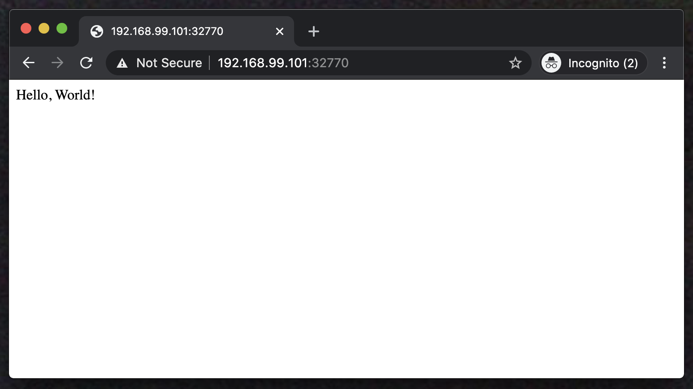
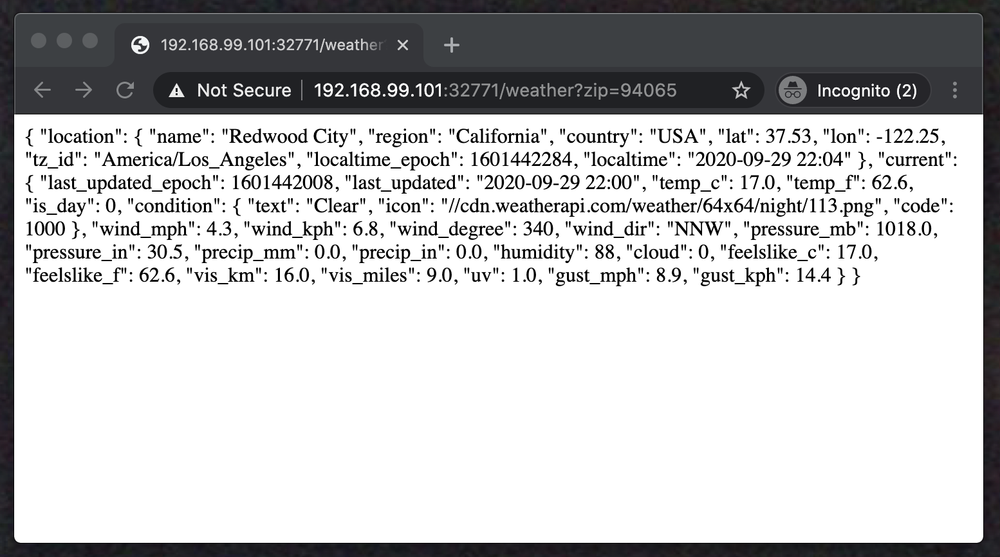
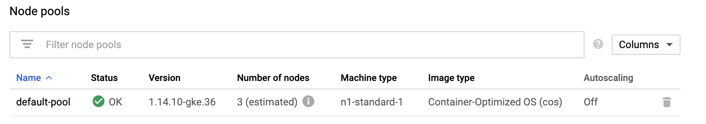

# Docker and Kubernetes Hands-On Workshop for Beginners

This project is a Workshop presented to Women in Technology World Series on November 20, 2020.

The Workshop will be presented in a virtual setting.

## Table of Contents  

[Getting Started](https://github.com/coder-lgtm/docker-k8s#getting-started)

[Prerequisites](https://github.com/coder-lgtm/docker-k8s#prerequisites)

[Installation](https://github.com/coder-lgtm/docker-k8s#installation)

[Demo 1: Launch Your Web Applications on your local machine](https://github.com/coder-lgtm/docker-k8s#demo-1-launch-your-web-applications-on-your-local-machine)

[Demo 2: Dockerize your Web application](https://github.com/coder-lgtm/docker-k8s#demo-2-dockerize-your-web-application)

[Demo 3: Kubernetes - Orchestrate your Web applications using Kubernetes](https://github.com/coder-lgtm/docker-k8s#demo-3-kubernetes---orchestrate-your-web-applications-using-kubernetes)

[Built With](https://github.com/coder-lgtm/docker-k8s#built-with)

[Authors](https://github.com/coder-lgtm/docker-k8s#authors)


## Getting Started

This project includes sample Python Flask applications and instructions for installing Docker on your local environment.

It is advisable but not mandatory that you have performed these steps beforehand. That way, you can follow along during the workshop to launch your Docker Container locally and later to a public cloud (Google Cloud Platform free tier account).

### Prerequisites

The steps below were executed on Macbooks running MacOS Catalina.

Steps for Windows and Chromebooks will be forthcoming. If you have questions, please contact the authors at the below:

* Rutuja Joshi rutujaj@gmail.com
* Anita Carey anitacarey1101@gmail.com


### Installation
This workshop assumes that the steps in this Installation section have been run and the environment is set up.

#### 1. Clone this repo
```
$ git clone git@github.com:coder-lgtm/docker-k8s.git
$ cd docker-k8s
```

#### 2. Install Homebrew
```
$ ./tools/brew_installation.sh
$ brew update
```

#### 3. Install Python
```
$ brew install python
```

#### 4. Install Pip
```
$ sudo easy_install pip
```

#### 5. Install dependency packages Flask and Requests
```
$ sudo pip install flask
$ pip install requests
```

#### 6. Install Docker

```
$ brew install docker
$ brew install docker-machine
```

#### 7. Install Virtualbox
The Virtualbox is the Virtual Machine where your Docker engine will run.
```
$ brew cask install virtualbox
```

If your Mac asks you for permission, go to System Preferences -> Security & Privacy -> General. You will see a message like `System software from developer "Oracle America, Inc." was blocked from loading`. Click on the lock in the lower left corner and click Allow, then run `brew cask install virtualbox` again.

#### 8. Validate the Docker installation
Create the Docker machine named "default" (this command also starts the Docker machine):
```
$ docker-machine create --driver virtualbox default
```

Confirm that the Docker machine is running:
```
$ docker-machine ls 
```

The expected output is shown below (with your different private IP):
```
NAME      ACTIVE   DRIVER       STATE     URL                         SWARM   DOCKER      ERRORS
default   *        virtualbox   Running   tcp://192.168.99.101:2376           v19.03.12
```

If your Docker machine did not start, run the start command below:
```
$ docker-machine start
```

#### 9. Set up the Docker CLI Environment
```
$ docker-machine env
$ eval $(docker-machine env)
```


### Demo 1: Launch Your Web Applications on your local machine

#### B1. Launch your Hello World web application
```
$ python ./app/helloworld/hello_world.py 
```

Point your browser to the below URL:
```
http://localhost:5000/
```

The expected response is:
```
Hello World!
```

#### B2. Launch your Weather API web application
```
$ python ./app/weathervane/weather_vane.py
```

Point your browser to the below URL, using the zip code of your choice (we are using the zip code for Redwood City, California):
```
http://localhost:5000/weather?zip=94065
```

The expected response is something like the below (it may be unformatted):
```
{
  "current": {
    "gust_kph": 11.5, 
    "last_updated": "2020-09-06 12:00", 
    "vis_miles": 9.0, 
    "pressure_in": 30.4, 
    "cloud": 0, 
    "precip_mm": 0.0, 
    "is_day": 1, 
    "feelslike_c": 30.0, 
    "condition": {
      "text": "Sunny", 
      "code": 1000, 
      "icon": "//cdn.weatherapi.com/weather/64x64/day/113.png"
    }, 
    "feelslike_f": 85.9, 
    "wind_mph": 0.0, 
    "temp_f": 87.8, 
    "temp_c": 31.0, 
    "last_updated_epoch": 1599418805, 
    "pressure_mb": 1015.0, 
    "vis_km": 16.0, 
    "precip_in": 0.0, 
    "wind_dir": "N", 
    "wind_kph": 0.0, 
    "uv": 8.0, 
    "humidity": 46, 
    "gust_mph": 7.2, 
    "wind_degree": 0
  }, 
  "location": {
    "name": "Redwood City", 
    "country": "USA", 
    "region": "California", 
    "tz_id": "America/Los_Angeles", 
    "lon": -122.25, 
    "lat": 37.53, 
    "localtime_epoch": 1599419443, 
    "localtime": "2020-09-06 12:10"
  }
}
```

### Demo 2: Dockerize your Web application


#### 1. Check Docker processes
```
$ docker ps
```

There should be no running processes and we will launch one during the workshop. The expected output is shown below:
```
CONTAINER ID        IMAGE               COMMAND             CREATED             STATUS              PORTS               NAMES
```

#### 2. Build Docker images
```
$ cd ./app/helloworld
$ docker build -t hello-world -f ./docker/Dockerfile .
```

```
$ cd ./app/weathervane
$ docker build -t weather-vane -f ./docker/Dockerfile .
```

#### 3. List Docker images
```
$ docker images
```

You should see output like the below for the Docker images that you just built.

```
REPOSITORY          TAG                 IMAGE ID            CREATED             SIZE
weather-vane        latest              c03f59b9ab99        4 seconds ago       55.6MB
hello-world         latest              6b8eff18876c        18 seconds ago      52.3MB
<none>              <none>              a592caad259b        2 weeks ago         40.8MB
python              3.6-alpine          176f50d88b04        3 weeks ago         40.8MB
```

#### 4. Launch Docker containers
```
$ docker run -d -P hello-world
```

```
$ docker run -d -P weather-vane
```

#### 5. List Docker containers 
```
$ docker ps
```

You should see output like the below for the Docker containers that you just launched.
```
CONTAINER ID        IMAGE               COMMAND                  CREATED             STATUS              PORTS                     NAMES
138ffc6438a7        weather-vane        "python weather_vane…"   4 seconds ago       Up 4 seconds        0.0.0.0:32771->5000/tcp   zen_greider
70f6c6dbfde7        hello-world         "python hello_world.…"   9 seconds ago       Up 9 seconds        0.0.0.0:32770->5000/tcp   flamboyant_blackwell
```

#### 6. Check your Dockerized applications on your browser

Find your Docker IP:
````
$ docker-machine url
````

You will get something like the below - your IP will be different. This is the IP address that your Docker containers are running on.
````
tcp://192.168.99.101:2376
````

Note in section C9 in the "PORTS" column that the port number for the "hello-world" image is 32770. Point your browser to your Docker container IP and your port. In this screen shot, the URL is "192.168.99.101:32770".




Note in section C9 in the "PORTS" column that the port number for the "weather-vane" image is 32771. Point your browser to your Docker container IP, your port, and the weather endpoint (we are using 94065 for Redwood City). In this screen shot, the URL is "192.168.99.101:32771/weather?zip=94065".




#### 7. Enter the running Docker container
```
$ docker exec -it <container id> /bin/sh
```


### Demo 3: Kubernetes - Orchestrate your Web applications using Kubernetes

#### 1. (Optional) Set Up Google Cloud Project 
We will demonstrate Kubernetes by using Google Cloud Project. We have set up a basic tier GCP by using the instructions at:
https://cloud.google.com/appengine/docs/standard/nodejs/building-app/creating-project

We will be using a 3-Node cluster as shown below:



#### 2. For accessing GCP project, you will need to install Google Cloud SDK (gcloud)
Please follow these instructions based on your OS: https://cloud.google.com/sdk/docs/downloads-interactive

#### Handy Shorthand for Kubectl (Kubernetes Command line tool)
```
$ alias k=kubectl
```

#### 3. Get Cluster Info
```
$ kubectl cluster-info 
```

#### 4. See what's running on the Kubernetes Cluster
```
$ kubectl get all
```

#### 5. Explore Nodes
```
$ kubectl get nodes -o wide
```

#### 6. Explore Pods
```
$ kubectl get nodes -o wide
```

#### 7. Explore Deployments
```
$ kubectl get deployments
```

#### 8. Create Deployment
```
$ kubectl create -f deployment.yaml 
```

#### 9. Expose Deployment as a Service
```
$ kubectl expose deployment docker-k8s-demo --type=LoadBalancer --name=my-service-demo --port=5000
```

#### 10. Scale Deployment Up
```
$ kubectl scale deployment docker-k8s-demo --replicas=3
```

#### 11. Scale Deployment Down
```
$ kubectl scale deployment docker-k8s-demo --replicas=1
```

#### 12. Enter the running kubernetes pod 
```
$ kubectl exec -it <pod id> /bin/sh
```


## Built With

* [Python](https://www.python.org/) - interpreted, high-level general purpose programming language
* [Flask](https://flask.palletsprojects.com/en/1.1.x/) - micro web framework written in Python
* [Docker Engine](https://docs.docker.com/engine/) - open-source containerization technology

## Authors

* [Rutuja Joshi](https://www.linkedin.com/in/rutuja/)
* [Anita Carey](https://www.linkedin.com/in/anitacarey/)

